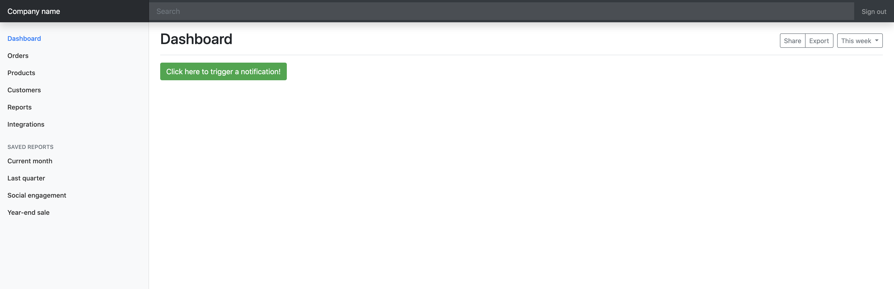
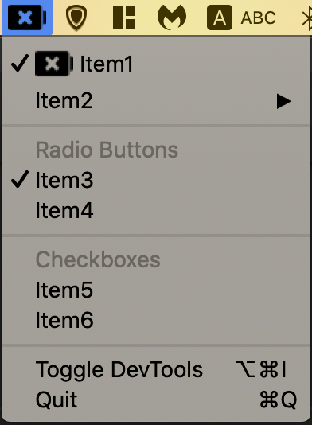

# ElectronSample
Just a sample to test electron feature and create a simple playground to test the features

## Steps Taken so far:
1- added simple notificaiton support using node-notifier
https://www.tutorialspoint.com/electron/electron_notifications.htm

2- Added Bootstrap and jquery with Bootstrap sample

3- Added electron-reload
https://ourcodeworld.com/articles/read/524/how-to-use-live-reload-in-your-electron-project

5- added tray with multiple item types such as Radio buttons, checkboxes, nested list, separator, and normal titles

Icons made by <a href="https://www.flaticon.com/authors/freepik" title="Freepik">Freepik</a> from <a href="https://www.flaticon.com/" title="Flaticon"> www.flaticon.com</a>
