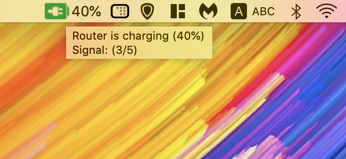
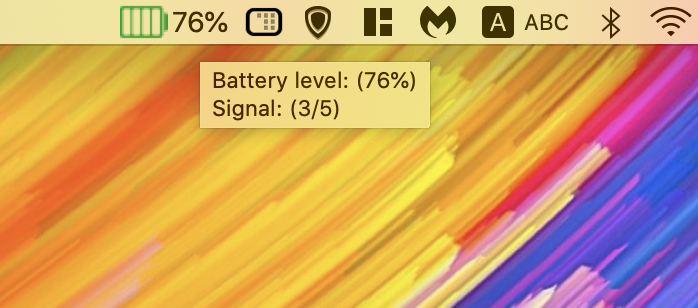
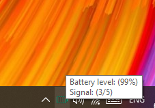
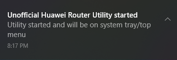

# Electron Huawei Router Unoffical utility
a simple app that once started will monitor the **Battery Life** and the **Signal Strength** of your Huawei router. 

Tested on Mac:
- Device name:	E5770S
- Hardware version:	CL1E5770SM
- Software version:	21.316.03.00.1133
- Web UI version:	17.100.13.02.1133

## when router is charging (hover over the battery icon to show tooltip):

## When router is using the battery:

## There are multiple Icons depending on the status of the router:
### Router is charging:   

### Battery is fully charged:

### Battery is above medium:

### Battery charge is medium:

### Battery charge is low:

### Battery charge is unknown or device is not using battery:

### Tested on Windows 10 showing power and siganl stregth:

### It will show a notificaiton once app start:

## How to use:
- clone or downlaod the solution.
- Go to directory and type  **"npm install"** in terminal or command prompt window.
- Type  **"npm start"** to run the app.

## Technologies used and credits:

| Technology              | Description                                                                                            | 
| ------------------- | --------------------------------------------------------------------------------------------------- | 
| `Electron JS`   | Cross platform framework for Desktop application development based on **Node JS**         | 
| `dialog-router-api`   | CA wrapper to connect with and query the API on the Huawei 4G routers (notably the Huawei B315) and any other supporting models. [ishan-marikar/dialog-router-api](https://github.com/ishan-marikar/dialog-router-api) | 
| `electron-reload`   | for quick reload when changes occur on the source code |
| `jquery`   | jquery pacakage for Node JS |
| `Bootstrap`   | Bootstrap lirary for potintial window UI |

## RoadMap
If the project got attention or i got extra time:

- [ ] Store the signal strength throughout the day and show it as a graph vs time to show how network change over time and what is the best place for router
- [ ] Add Network checker that will stop the timer if no network and start it again once network is back.
- [ ] Add a checker if user is connected to Huawei router and stop the timer if not.
- [ ] Add a UI for signal strength and other info such as usage
- [ ] Show a notification if battery is low

#### Once Logged In:
- [ ] Switch Network Type
- [ ]  Turn Off/Reboot
- [ ]  choose best channel and test all configurations 

### Icons made by <a href="https://www.flaticon.com/authors/freepik" title="Freepik">Freepik</a> from <a href="https://www.flaticon.com/" title="Flaticon"> www.flaticon.com</a>
